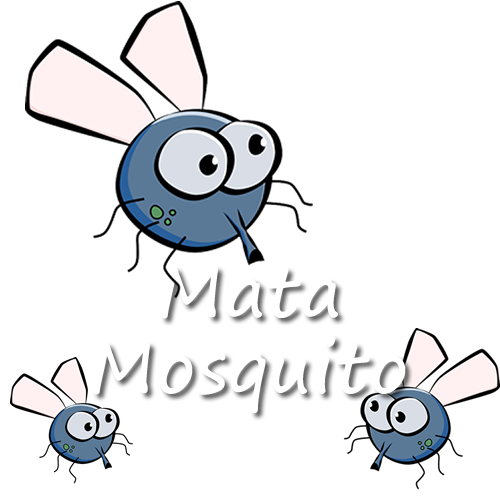

# 🦟🎮 Mata-Mosquito: O Jogo que Vai Testar Seus Reflexos! [](https://github.com/DanAntunes/mata-mosquito)

**Prepare-se para uma batalha épica contra os insetos mais rápidos da web!**  
*"John Wick dos mosquitos? Aqui é onde você prova seu valor!"* 😎

[](LICENSE)
[](https://github.com/DanAntunes/mata-mosquito)

<p align="center">
  
</p>

## 🚀 Sobre o Jogo

Em **Mata-Mosquito**, você é o exterminador de insetos digital! Desenvolvido com paixão em JavaScript puro, este jogo traz:

- **3 Níveis de Insanidade**: Do Normal ao lendário **Modo John Wick**! 🐺
- **Design Responsivo**: Jogue em qualquer dispositivo! 📱💻
- **Sistema de Vidas**: ❤️❤️❤️ Cuidado com os ataques sorrateiros!
- **Contagem Regressiva**: ⏳ 15 segundos para provar sua habilidade!
- **Acessibilidade**: ♿ Desenvolvido com foco em inclusão digital

**Dica Profissional:** No modo John Wick, os mosquitos evoluíram para *super sayajins*! 🦟💥

## ✨ Funcionalidades Incríveis

✅ **Sistema de Dificuldade Dinâmico**  
✅ **Mosquitos com Tamanhos Aleatórios** (Pequeno, Médio e **GIGANTE**)  
✅ **Movimento Espelhado** (Alguns são canhotos traiçoeiros!)  
✅ **Efeitos Visuais Smooth** com CSS3  
✅ **SEO Otimizado** para Buscas  
✅ **Design Dark Mode** Automático  
✅ **Cursor Temático** Personalizado

## 🕹️ Como Jogar

1. **Escolha seu Destino**:
   - 🌶️ Normal (Para mortais)
   - 🔥 Difícil (Desafio ninja)
   - ☠️ John Wick (Apenas para deuses)

2. **Clique Freneticamente** nos mosquitos antes que:
   - ⌛ O tempo acabe
   - ❤️ Suas vidas se esgotem

3. **Sobreviva** para ver sua **Vitória Épica**! 🏆

## ⚙️ Instalação

```bash
# Clone o repositório
git clone https://github.com/DanAntunes/web-game-mata-mosquito

# Entre no diretório
cd mata-mosquito

# Abra o jogo no navegador
start index.html # Windows
open index.html  # MacOS
```

**Live Demo:** [Jogue Agora!](#) *(Adicione seu link de deploy aqui)*

## 🛠️ Tecnologias Usadas

| Tech | Por Que? |
|------|----------|
|  | Estruturação Semântica do Apocalipse |
|  | Estilização Assassina |
|  | Lógica Implacável |
|  | Design Responsivo Ninja |

## 🤝 Contribuição

Quer ser um **Herói Anti-Mosquito**?  
1. 🍴 Faça um Fork
2. 🌿 Crie sua Branch (`git checkout -b feature/mataMais`)
3. 💾 Commit suas Mudanças (`git commit -m 'Adiciona feature'`)
4. 📌 Push para a Branch (`git push origin feature/mataMais`)
5. 🔃 Abra um Pull Request

**[Código de Conduta](https://www.contributor-covenant.org/)**

## 📜 Licença

MIT License - Veja o arquivo [LICENSE](LICENSE) para detalhes.

---

Feito com ❤️ e 🧨 por [Danilo Antunes](https://github.com/DanAntunes)  
**Dedicado a todos que já tentaram matar um mosquito com um clique!** 🖱️💥

 
*Tempo médio de sobrevivência: 7.8 segundos. Você consegue bater?* 😏